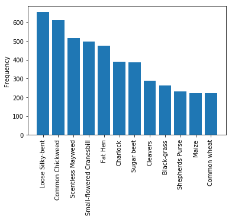
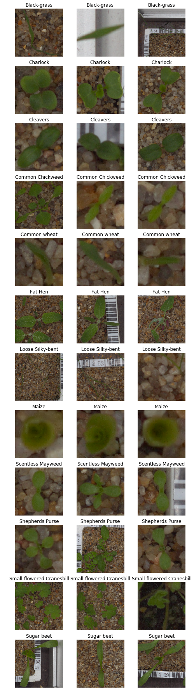
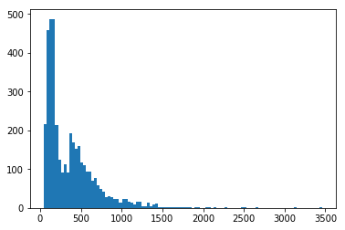
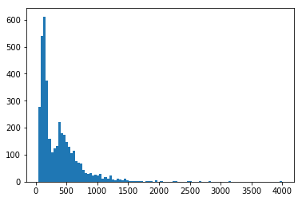
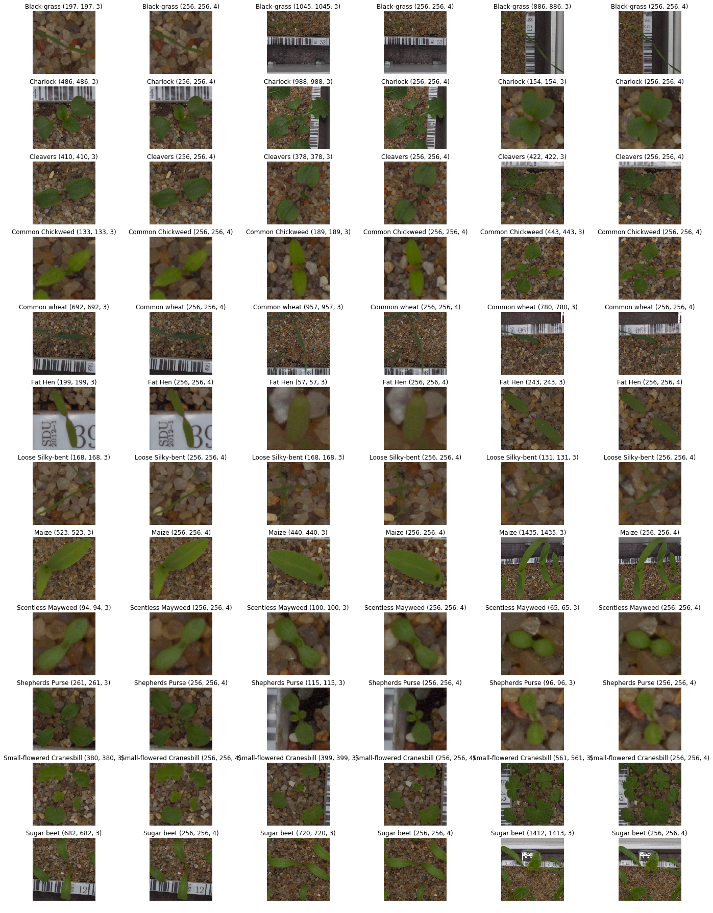

```python
import glob
import numpy as np
import pandas as pd
import matplotlib.pyplot as plt
%matplotlib inline
```

The filenames have the plant names so let us create a dataframe mapping the category to a numeric class label.


```python
files = np.sort(glob.glob('../fedfarm/train/*/*png'))
labels = [f.split('/')[-2] for f in files]
names = np.sort(np.unique(labels))
label_df = pd.DataFrame({'category': names, 'label': np.arange(len(names))})
label_df
```


<div>
<style scoped>
    .dataframe tbody tr th:only-of-type {
        vertical-align: middle;
    }

    .dataframe tbody tr th {
        vertical-align: top;
    }

    .dataframe thead th {
        text-align: right;
    }
</style>
<table border="1" class="dataframe">
  <thead>
    <tr style="text-align: right;">
      <th></th>
      <th>category</th>
      <th>label</th>
    </tr>
  </thead>
  <tbody>
    <tr>
      <th>0</th>
      <td>Black-grass</td>
      <td>0</td>
    </tr>
    <tr>
      <th>1</th>
      <td>Charlock</td>
      <td>1</td>
    </tr>
    <tr>
      <th>2</th>
      <td>Cleavers</td>
      <td>2</td>
    </tr>
    <tr>
      <th>3</th>
      <td>Common Chickweed</td>
      <td>3</td>
    </tr>
    <tr>
      <th>4</th>
      <td>Common wheat</td>
      <td>4</td>
    </tr>
    <tr>
      <th>5</th>
      <td>Fat Hen</td>
      <td>5</td>
    </tr>
    <tr>
      <th>6</th>
      <td>Loose Silky-bent</td>
      <td>6</td>
    </tr>
    <tr>
      <th>7</th>
      <td>Maize</td>
      <td>7</td>
    </tr>
    <tr>
      <th>8</th>
      <td>Scentless Mayweed</td>
      <td>8</td>
    </tr>
    <tr>
      <th>9</th>
      <td>Shepherds Purse</td>
      <td>9</td>
    </tr>
    <tr>
      <th>10</th>
      <td>Small-flowered Cranesbill</td>
      <td>10</td>
    </tr>
    <tr>
      <th>11</th>
      <td>Sugar beet</td>
      <td>11</td>
    </tr>
  </tbody>
</table>
</div>


Let us look at the data distribution. For complete fairness we should do this for a training set only but as we are going to make a random split the distribution will be the same for training and validation.


```python
files_df = pd.DataFrame({'filename': files, 'category': labels})
files_df = pd.merge(files_df, label_df, on=['category'], how='left')
files_df.category.value_counts()
```


    Loose Silky-bent             654
    Common Chickweed             611
    Scentless Mayweed            516
    Small-flowered Cranesbill    496
    Fat Hen                      475
    Charlock                     390
    Sugar beet                   385
    Cleavers                     287
    Black-grass                  263
    Shepherds Purse              231
    Maize                        221
    Common wheat                 221
    Name: category, dtype: int64


The dataset is unbalanced but not massively.


```python
fig, ax = plt.subplots(1)
ax.bar(np.arange(12), files_df.category.value_counts())
ax.set_xticks(np.arange(12));
ax.set_xticklabels(files_df.category.value_counts().index.values, rotation=90);
ax.set_ylabel('Frequency');
```





Let us look at some of the images.


```python
fig, axes = plt.subplots(12, 3)
fig.set_figheight(32)
fig.set_figwidth(8)
for i, name in enumerate(names):
    f = files_df[files_df.category == name].sample(3).filename.values
    for j in range(3):
        axes[i][j].imshow(plt.imread(f[j]))
        axes[i][j].axis('off')
        axes[i][j].set_title(name)
```





Here we taken 4000 examples for training, keeping the rest for validation and divided these into 10 shards each with 400 examples. In contrast to the original paper these would not be iid shards since the dataset (unlike MNIST) is unbalanced so it is more accurate to describe the shards as representative of the class distribution rather than IID (although I have named the columns iid/non-iid to keep in line with the paper). 


```python
train, val = np.split(np.random.permutation(4750), [4000])
train_df = files_df.loc[train].sort_values(by='category')
val_df = files_df.loc[val]
```


```python
n_shards = 10
shards_iid = np.random.permutation(np.tile(np.arange(n_shards), 400))
len(shards_iid)
```


    4000


For the non-iid shards, to place images in shards so that just a few classes are in each shard, each shard indices are repeated to get a pair of arrays per shard of length 200. Then the arrays are shuffled resulting in 20 arrays, concatenated and assigned to the examples which have been sorted. 


```python
# [[0, ..., 0], ..., [9, ..., 9], [0, ..., 0], ..., [9, ..., 9]]
shards_non_iid = np.tile(np.tile(np.arange(n_shards)[:, None], [1, 200]), [2, 1])
shards_non_iid = np.concatenate(np.random.permutation(shards_non_iid))
```


```python
train_df['shard_iid'] = shards_iid
train_df['shard_non_iid'] = shards_non_iid
```

Only a few classes per non_iid shard which leads to class distributions in each shard that are very different from the data distribution. 


```python
train_df.groupby('shard_non_iid', as_index=False).category.agg(lambda x: len(x.category.unique())).rename(columns={'category': 'num_categories'})
```


<div>
<style scoped>
    .dataframe tbody tr th:only-of-type {
        vertical-align: middle;
    }

    .dataframe tbody tr th {
        vertical-align: top;
    }

    .dataframe thead th {
        text-align: right;
    }
</style>
<table border="1" class="dataframe">
  <thead>
    <tr style="text-align: right;">
      <th></th>
      <th>shard_non_iid</th>
      <th>num_categories</th>
    </tr>
  </thead>
  <tbody>
    <tr>
      <th>0</th>
      <td>0</td>
      <td>3</td>
    </tr>
    <tr>
      <th>1</th>
      <td>1</td>
      <td>3</td>
    </tr>
    <tr>
      <th>2</th>
      <td>2</td>
      <td>3</td>
    </tr>
    <tr>
      <th>3</th>
      <td>3</td>
      <td>2</td>
    </tr>
    <tr>
      <th>4</th>
      <td>4</td>
      <td>3</td>
    </tr>
    <tr>
      <th>5</th>
      <td>5</td>
      <td>4</td>
    </tr>
    <tr>
      <th>6</th>
      <td>6</td>
      <td>3</td>
    </tr>
    <tr>
      <th>7</th>
      <td>7</td>
      <td>2</td>
    </tr>
    <tr>
      <th>8</th>
      <td>8</td>
      <td>3</td>
    </tr>
    <tr>
      <th>9</th>
      <td>9</td>
      <td>4</td>
    </tr>
  </tbody>
</table>
</div>


```python
td = pd.read_csv('train_resized.csv')
groups = td.groupby('shard_non_iid').groups
```

These shards are not evenly balanced either for the most part.


```python
for k, v in groups.items():
    df = ( pd.DataFrame(td.loc[v]).label.value_counts().reset_index().rename(
     columns={'index': 'label', 'label': 'count'}))
    print('shard', k)
    print('label {}'.format(' '.join(map('{:3d}'.format, df.label.values) )))
    print('count {}'.format(' '.join(map('{:3d}'.format, df['count'].values) )))
    print()
```

    shard 0
    label   6  10   9
    count 200 128  72
    
    shard 1
    label   0   6   5
    count 200 101  99
    
    shard 2
    label   3   7   6
    count 200 149  51
    
    shard 3
    label  10   8
    count 200 200
    
    shard 4
    label   5   2   3
    count 200 183  17
    
    shard 5
    label  11   3   4  10
    count 121 111  89  79
    
    shard 6
    label   1   2   0
    count 330  57  13
    
    shard 7
    label   6   3
    count 200 200
    
    shard 8
    label  11   8   7
    count 200 163  37
    
    shard 9
    label   9   4   5   8
    count 122 101  99  78
    


```python

```


<div>
<style scoped>
    .dataframe tbody tr th:only-of-type {
        vertical-align: middle;
    }

    .dataframe tbody tr th {
        vertical-align: top;
    }

    .dataframe thead th {
        text-align: right;
    }
</style>
<table border="1" class="dataframe">
  <thead>
    <tr style="text-align: right;">
      <th></th>
      <th>label</th>
      <th>count</th>
    </tr>
  </thead>
  <tbody>
    <tr>
      <th>0</th>
      <td>9</td>
      <td>122</td>
    </tr>
    <tr>
      <th>1</th>
      <td>4</td>
      <td>101</td>
    </tr>
    <tr>
      <th>2</th>
      <td>5</td>
      <td>99</td>
    </tr>
    <tr>
      <th>3</th>
      <td>8</td>
      <td>78</td>
    </tr>
  </tbody>
</table>
</div>


```python
train_df.groupby('shard_iid', as_index=False).category.agg(lambda x: len(x.category.unique())).rename(columns={'category': 'num_categories'})
```


<div>
<style scoped>
    .dataframe tbody tr th:only-of-type {
        vertical-align: middle;
    }

    .dataframe tbody tr th {
        vertical-align: top;
    }

    .dataframe thead th {
        text-align: right;
    }
</style>
<table border="1" class="dataframe">
  <thead>
    <tr style="text-align: right;">
      <th></th>
      <th>shard_iid</th>
      <th>num_categories</th>
    </tr>
  </thead>
  <tbody>
    <tr>
      <th>0</th>
      <td>0</td>
      <td>12</td>
    </tr>
    <tr>
      <th>1</th>
      <td>1</td>
      <td>12</td>
    </tr>
    <tr>
      <th>2</th>
      <td>2</td>
      <td>12</td>
    </tr>
    <tr>
      <th>3</th>
      <td>3</td>
      <td>12</td>
    </tr>
    <tr>
      <th>4</th>
      <td>4</td>
      <td>12</td>
    </tr>
    <tr>
      <th>5</th>
      <td>5</td>
      <td>12</td>
    </tr>
    <tr>
      <th>6</th>
      <td>6</td>
      <td>12</td>
    </tr>
    <tr>
      <th>7</th>
      <td>7</td>
      <td>12</td>
    </tr>
    <tr>
      <th>8</th>
      <td>8</td>
      <td>12</td>
    </tr>
    <tr>
      <th>9</th>
      <td>9</td>
      <td>12</td>
    </tr>
  </tbody>
</table>
</div>


```python
# train_df.to_csv('seedlings_train.csv')
# val_df.to_csv('seedlings_val.csv')
```


```python
len(files)
```


    4750


```python
heights, widths, channels = zip(*list(map(plt.imread, files)))
```


```python
shapes = pd.read_csv('train_resized.csv')['shape'].values
```


```python
height, width, channels = zip(*map(eval, shapes))
```

# Input pipeline

The image dimensions vary quite a lot but the aspect ratio is 1:1 for almost all of them. I resized all the images to be $256 \times 256$. 


```python
plt.hist(height, bins=100);
```





```python
plt.hist(width, bins=100);
```





```python
from collections import Counter
aspect_ratio_counts = Counter(np.divide(height, width))
aspect_ratio_counts.most_common(10)
```


    [(1.0, 3937),
     (1.0600315955766193, 13),
     (0.9129353233830846, 3),
     (0.9994853319608852, 3),
     (0.9547244094488189, 3),
     (0.9, 2),
     (0.9413886384129847, 2),
     (0.9990059642147118, 1),
     (0.9992972593113141, 1),
     (1.0454545454545454, 1)]


A few images seem to be in the RGBA format so we will explicitly select only the first 3 channels when loading in the data.


```python
channel_counts = Counter(channels)
channel_counts
```


    Counter({3: 3978, 4: 22})


Visual inspection suggests that the quality does not seem to be affected too much by resizing.


```python
resized_df = pd.read_csv('train_resized.csv')
n = 3
fig, axes = plt.subplots(12, n*2, figsize=(24, 32))
for i, name in enumerate(names):
    f = resized_df[resized_df.category == name].sample(n).filename.values
    for j in range(0, n*2, 2):
        fns = [f[j//2].replace('train_256x256x3', 'train'), f[j//2]]
        for jj, fn in zip(range(j, j+2), fns):
            im = plt.imread(fn)
            axes[i][jj].imshow(im)
            axes[i][jj].axis('off')
            axes[i][jj].set_title(name + ' ' + str(im.shape))
```




